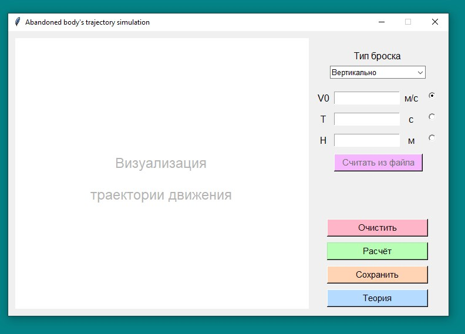
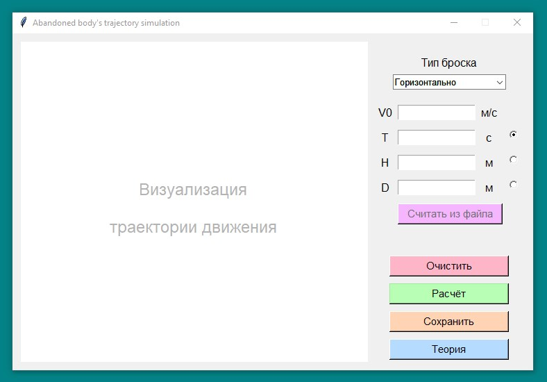
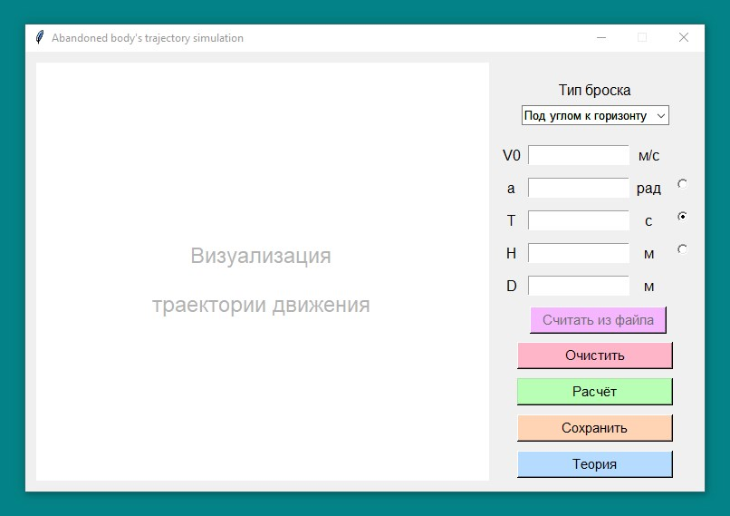

# Приложение для моделирования траектории движения брошенного тела

[Конференция "Инженеры будущего". Направление "ИТ".](http://profil.mos.ru/it/?page_id=2541)

**Моделирование траектории движения брошенного тела".**

[Исходный текст технического задания](docs/technical-requirements.pdf)

## Навигация

* [Описание проекта](#chapter-0)
* [Как начать](#chapter-1)
* [Интерфейс приложения](#chapter-2)
* [Код](#chapter-3)
* [Лицензия](#chapter-4)

<a id="chapter-0"></a>

## Описание проекта

Приложение для моделирования траектории движения брошенного тела.

[Техническая документация](docs/technical-documentation.docx)

### Функциональность

1. Выбор типа броска тела (вертикально вверх, горизонтально, под углом к горизонту)
2. Возможность ввести данные задачи как с клавиатуры, так и из файла
   (_чтение из файла ещё не реализовано_), чтобы получить ответ
3. Возможность вычислить параметры по остальным имеющимся, верно для любого параметра:
   длительность / дальность / высоту полета, угол, под которым было брошено тело
4. Визуализация траектории движения (_ещё не реализовано_)
5. Ознакомление с теорией по теме (открытие информационного ресурса в браузере)
6. Сохранение результатов локально

<a id="chapter-1"></a>

## :hammer: Как начать

1. Установить [Python 3](https://www.python.org/downloads/)
2. Скачать данный репозиторий
    * Вариант 1
        1. Установить [Git](https://git-scm.com/download/win)
        2. Клонировать репозиторий
       ```bash
       git clone https://github.com/Yu-Leo/trajectory-simulation
       cd trajectory-simulation
       ```
    * Вариант 2 - [Скачать ZIP](https://github.com/Yu-Leo/trajectory-simulation/archive/main.zip)

3. Запустить `./main.py`

<a id="chapter-2"></a>

## Интерфейс приложения

### Тип броска: вертикально вверх



### Тип броска: горизонтально



### Тип броска: под углом к горизонту



При помощи радио-кнопок справа от полей ввода выбирается значение, по которому необходимо произвести расчёт.

**!** В режимах броска "Горизонтально" и "Под углом к горизонту" необходимо указывать начальную скорость, вне
зависимости от выбора параметра, по которому необходимо произвести расчёт.

### Кнопки:

**[Считать из файла]** - чтение типа броска и его параметров из файла (_ещё не реализовано_)

**[Очистить]** - очистка всех полей ввода-вывода и визуализации

**[Расчёт]** - произвести расчёт остальных параметров по выбранному значение и визуализировать бросок (_визуализация ещё
не реализована_)

**[Сохранить]** - сохранение типа и параметров броска в файл

**[Теория]** - открытие информационного ресурса в браузере

<a id="chapter-3"></a>

## Код

### Используемые библиотеки

* [tkinter](https://docs.python.org/3/library/tkinter.html) - графический интерфейс приложения
* [json](https://docs.python.org/3/library/json.html) - работа с форматом json
* [webbrowser](https://docs.python.org/3/library/webbrowser.html) - открытие веб-сайтов в браузере

<a id="chapter-4"></a>

## :open_hands: Лицензия

GNU General Public License v3.0.

Полный текст в [LICENSE](LICENSE)